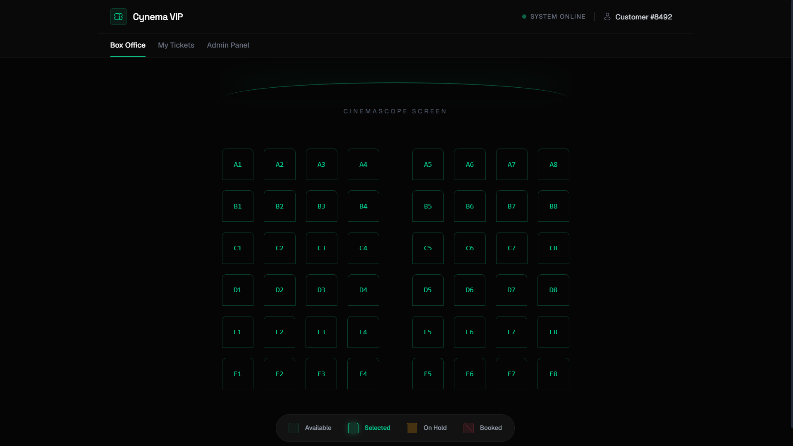
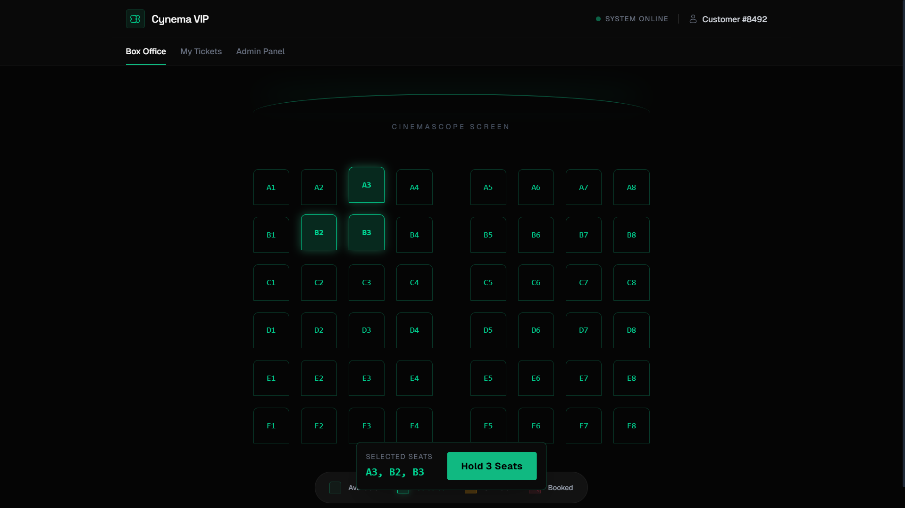
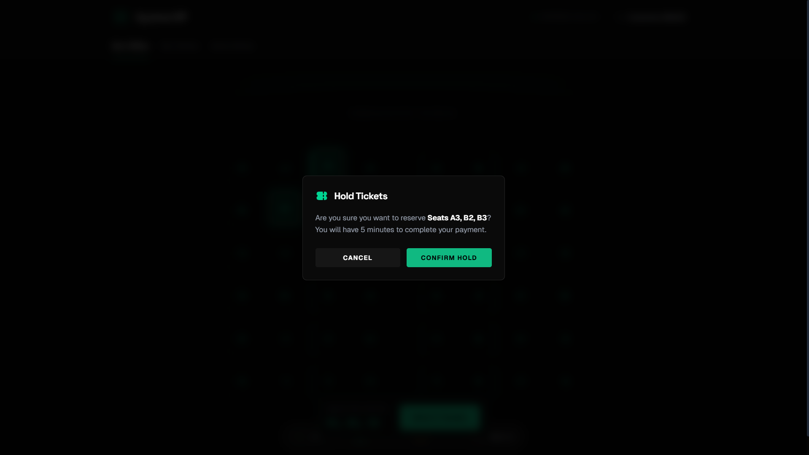
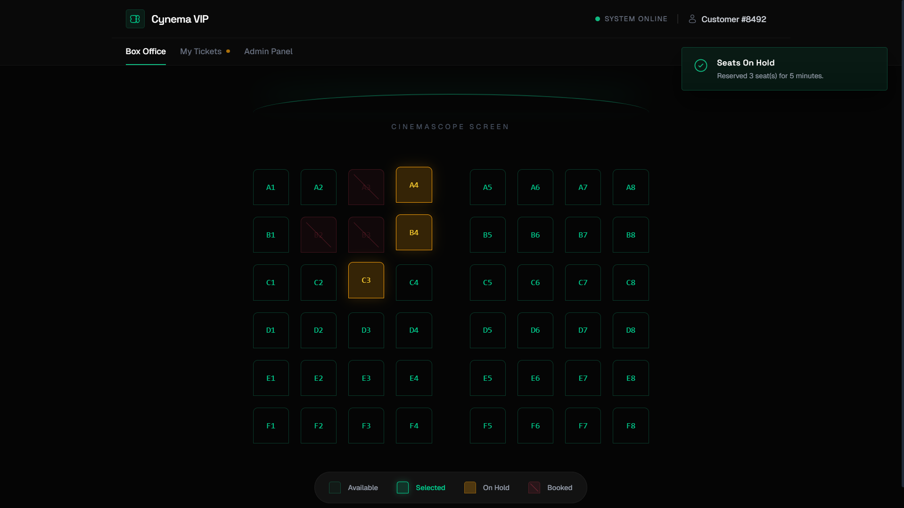
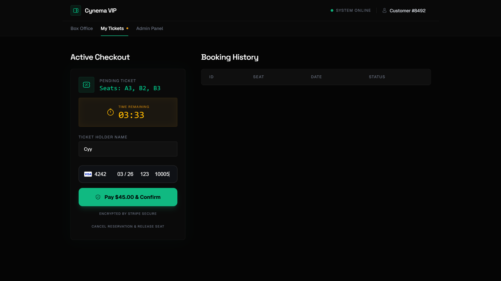
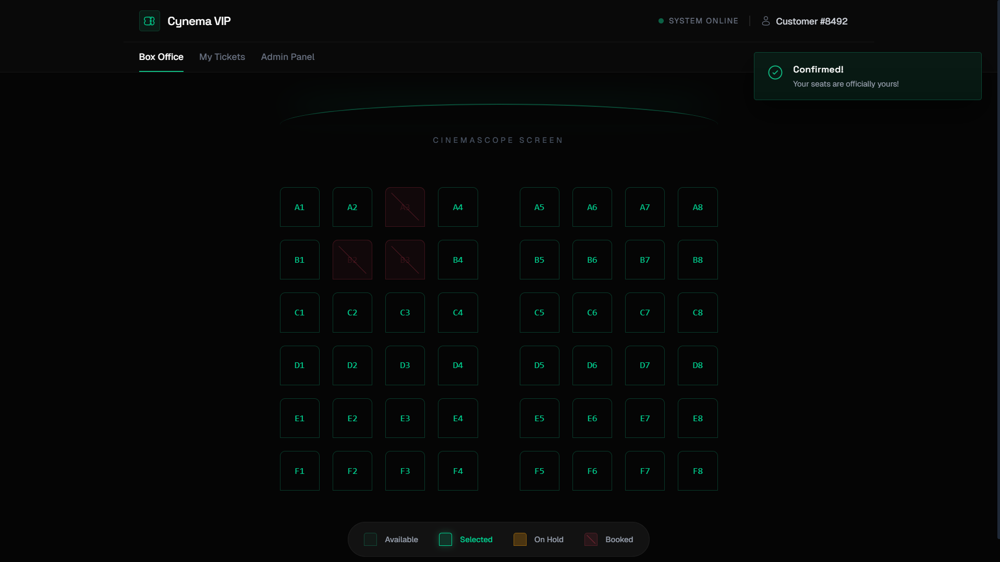
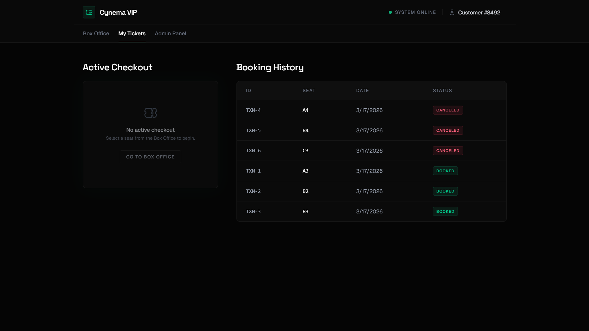
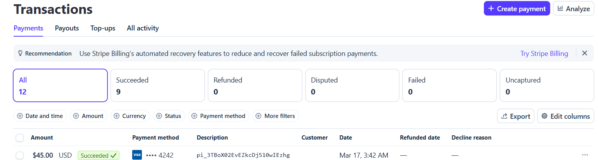
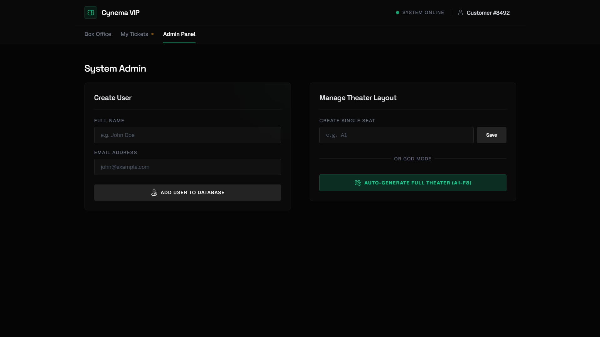

# VIP Booking System

A full-stack, high-concurrency event ticketing platform designed to handle real-time movie theater seat reservations. Built to withstand race conditions and double-booking attempts using production-ready system design principles.

## System Architecture & Design
This project implements a modern **Three-Tier Architecture** (Client -> API -> Database) and tackles complex distributed system challenges:

* **Concurrency Control (Pessimistic Locking):** When a user selects a seat, the system immediately locks it with a `PENDING` status. This strictly prevents any other user from interacting with or booking that specific seat during the checkout phase.
* **State Management & Timers:** Tickets are held in the user's cart for a strict 5-minute checkout window before expiring.
* **Asynchronous Background Worker (Cleaner):** A parallel `asyncio` task continuously polls the PostgreSQL database to detect abandoned carts. It automatically releases expired seats back to the `AVAILABLE` pool without blocking or slowing down the main API loop.

---

## Application Flow & Interface

### 1. The Box Office
Users start by viewing the live theater grid. The UI dynamically reflects real-time database states (`Available`, `Selected`, `On Hold`, `Booked`).


### 2. Multi-Seat Selection
Users can select multiple seats at once. Selected seats feature a custom emerald UI glow, and a floating action bar tracks the pending selection.


### 3. Hold Confirmation
Before locking the database, the system confirms the exact seats the user intends to hold.


### 4. Pessimistic Locking (Concurrency Control)
Once confirmed, the system locks the seats with a `PENDING` status (Amber). No other user can interact with these seats for the next 5 minutes.


### 5. Secure Checkout
The user is taken to the active checkout panel, featuring a real-time countdown timer, an itemized order summary, and a secure Stripe payment element.


### 6. Success Confirmation
Upon successful payment, the database permanently updates the seats to `BOOKED` (Red), and the UI instantly reflects the confirmed ownership.


### 7. Booking History & Ledger
Users have access to a complete ledger of their session, tracking both successfully confirmed tickets and canceled or expired reservations.


### 8. Payment Verification
Transactions are securely verified and processed via the Stripe API.


### 9. System Admin Panel
A protected "God-mode" dashboard allowing administrators to provision new users and dynamically map out or reset theater seats. 
> **Note:** The Admin Panel is currently under active development. While the foundation can be seen when cloning the repository, full routing and functionality are still a Work in Progress (WIP).


---

## Tech Stack

**Backend**
* **Python / FastAPI:** High-performance REST API routing and core logic.
* **PostgreSQL:** Relational database serving as the ultimate source of truth.
* **SQLAlchemy:** Object-Relational Mapping (ORM) for secure database queries.
* **Uvicorn:** ASGI Web Server.

**Frontend**
* **React:** Component-based UI framework.
* **TypeScript:** Strict static typing for frontend blueprints and interfaces.
* **Vite:** Blazing-fast build tool and development server.
* **Tailwind CSS v4:** Utility-first styling for a modern, dark-mode VIP aesthetic.

## Core Features
* **Live Box Office Grid:** Visual representation of seats with distinct states (`Available`, `On Hold`, `Booked`).
* **Active Cart Checkout:** Real-time visual countdown timer (05:00) to finalize transactions.
* **Automated Self-Healing:** Expired tickets are automatically scrubbed from the database and visually reset on the grid.
* **Admin Dashboard (WIP):** "God-mode" panel to instantly provision new users and map out new theater seats dynamically (Currently under development).

## Local Development Setup

### Prerequisites
* Python 3.10+
* Node.js & npm
* PostgreSQL running locally

### 1. Start the Backend API
Open your first terminal and run the following commands:
```bash
# Clone the repository
git clone [https://github.com/wency01x/booking-system.git](https://github.com/wency01x/booking-system.git)
cd booking-system

# Activate your virtual environment
venv\Scripts\activate  # Windows
# source venv/bin/activate  # Mac/Linux

# Install Python dependencies
pip install -r requirements.txt

# Start the FastAPI server (runs on Port 8001)
uvicorn app.main:app --reload --port 8001
